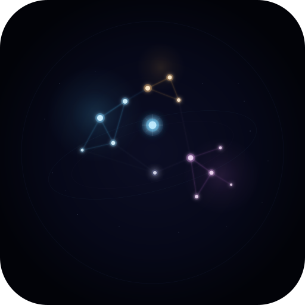

# 🌌 Galaxy Graph

<p align="center">
  
</p>

<p align="center">
  <strong>Visualize your Obsidian vault as an interactive 3D galaxy.</strong><br/>
  Notes become stars. Links become constellations. Clusters glow as nebulae.<br/>
  The hidden structure of your thinking, rendered in light.
</p>

<p align="center">
  <a href="LICENSE"></a>
  <a href="https://obsidian.md"></a>
  <a href="https://threejs.org"></a>
</p>

<!-- TODO: Replace with actual screenshots -->
<!--  -->

---

## Features

**Visual**
- 3D galaxy rendered with Three.js and WebGL
- Custom GLSL shaders for radial star glow with white-hot cores
- Dual-layer rendering: bright core sprites + diffuse glow halos
- UnrealBloomPass post-processing for real light bleed
- Animated energy pulses flowing along link lines
- Dual-layer nebulae (inner core + outer halo) with organic breathing animation
- 3,000 ambient background stars with slow rotation
- ACES filmic tone mapping for cinematic color

**Intelligence**
- Louvain community detection discovers organic clusters from link structure
- Stars and nebulae colored by algorithmic communities, not folder hierarchy
- Modularity score measures how structured your vault is
- Tag extraction from both frontmatter and inline `#tags`

**Interaction**
- Orbit, zoom, and pan through your galaxy with damped controls
- Hover any star to see its note name, community, and link count
- Click a star to open the note in Obsidian
- Fuzzy search with Ctrl/Cmd+F — camera warps to the found star with a flare animation
- Filter panel to isolate clusters, folders, or tags — non-matching stars dim to near-invisible
- Slow auto-rotate for ambient display

**Performance**
- All stars rendered in a single draw call via point sprites
- Force-directed layout runs in a Web Worker (zero main-thread blocking)
- Community detection runs in near-linear time (< 200ms for 5,000 notes)
- Smooth at 60fps with 3,000+ notes

---

## Installation

### From Obsidian Community Plugins (coming soon)

1. Open **Settings → Community Plugins → Browse**
2. Search for "Galaxy Graph"
3. Click **Install**, then **Enable**

### Manual Installation

1. Download the latest release from the [Releases](https://github.com/YOUR_USERNAME/obsidian-galaxy-graph/releases) page
2. Extract `main.js`, `manifest.json`, and `styles.css` into your vault's `.obsidian/plugins/galaxy-graph/` directory
3. Enable the plugin in **Settings → Community Plugins**

### Build from Source

```bash
git clone https://github.com/YOUR_USERNAME/obsidian-galaxy-graph.git
cd obsidian-galaxy-graph
npm install
npm run build
```

Then copy `main.js`, `manifest.json`, and `styles.css` to your vault's `.obsidian/plugins/galaxy-graph/`.

For development with hot reload:

```bash
npm run dev
```

---

## Usage

1. Click the **orbit icon** (🪐) in the left ribbon, or run the command **"Open Galaxy Graph"** from the command palette.
2. **Orbit** by dragging. **Zoom** with scroll. **Pan** with right-drag.
3. **Hover** over stars to see note names. **Click** to open the note.
4. Press **Ctrl/Cmd+F** to search — the camera flies to the found star.
5. Click the **⬡ button** (top-right) to open the filter panel and isolate clusters, folders, or tags.

---

## How It Works

### The Galaxy Metaphor

| Vault Concept | Galaxy Element | Visual |
|--------------|---------------|--------|
| Note | Star | Size = link count, color = community |
| Link | Constellation line | Gradient between endpoint colors, animated energy flow |
| Cluster (Louvain) | Nebula | Soft dual-layer glow behind dense groups |
| Orphan note | Background dust | Dim, drifting particle |

### Community Detection

Rather than coloring by folder, Galaxy Graph uses the **Louvain algorithm** to discover organic clusters from link structure alone. Notes that heavily cross-reference each other end up in the same community — even if they live in different folders.

See [docs/louvain-community-detection.md](docs/louvain-community-detection.md) for a full explanation of the algorithm.

### Architecture

```
src/
├── GalaxyView.ts              # Obsidian ItemView — mounts canvas, wires panels
├── scene/
│   ├── GalaxyScene.ts         # Three.js scene, camera, bloom, render loop
│   ├── StarField.ts           # Shader-based point sprites (core + glow layers)
│   ├── LinkLines.ts           # Animated edge lines with energy flow
│   ├── NebulaMesh.ts          # Dual-layer nebula sprites per community
│   ├── BackgroundStars.ts     # Ambient particle field
│   └── Shaders.ts             # Custom GLSL (star, glow, link shaders)
├── layout/
│   ├── GraphBuilder.ts        # Reads vault → nodes + edges + communities
│   ├── Clustering.ts          # Louvain community detection algorithm
│   └── ForceWorker.ts         # Web Worker force-directed layout
├── interaction/
│   ├── SearchPanel.ts         # Fuzzy search with camera warp + flare
│   └── FilterPanel.ts         # Cluster/folder/tag filter sidebar
└── settings/
    └── Settings.ts            # Plugin settings tab
```

---

## Settings

| Setting | Default | Description |
|---------|---------|-------------|
| Star size multiplier | 1.0 | Scale all stars (0.5 – 3.0) |
| Show orphan notes | On | Display unlinked notes as dim dust |
| Bloom strength | 1.2 | Intensity of glow effect (0 – 3.0) |
| Bloom radius | 0.6 | How far glow spreads (0 – 2.0) |
| Bloom threshold | 0.2 | Minimum brightness to glow (0 – 1.0) |
| Auto-rotate | On | Slow ambient galaxy rotation |

---

## Roadmap

- [ ] VR / WebXR support
- [ ] Time-travel mode: animate how the galaxy evolved over time
- [ ] Mini-map overlay
- [ ] Custom color themes
- [ ] Export galaxy as image/video
- [ ] Hierarchical zoom (zoom into a community → see its internal structure)
- [ ] Performance: Barnes-Hut approximation for 10k+ note vaults

---

## Contributing

Contributions are welcome! Please read the [Contributing Guide](CONTRIBUTING.md) and [Code of Conduct](CODE_OF_CONDUCT.md) before getting started.

---

## License

[MIT](LICENSE) — use it, fork it, make it yours.

---

## Acknowledgments

- [Obsidian](https://obsidian.md) for the incredible knowledge platform
- [Three.js](https://threejs.org) for making WebGL accessible
- [Blondel et al. (2008)](https://arxiv.org/abs/0803.0476) for the Louvain algorithm
- The Obsidian plugin community for inspiration and documentation
